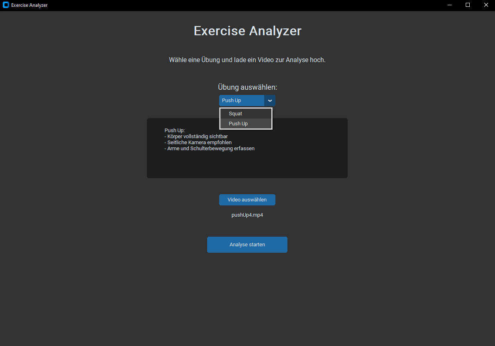
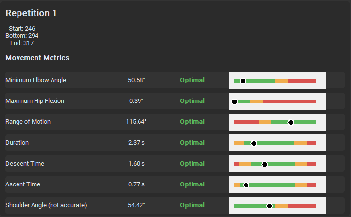
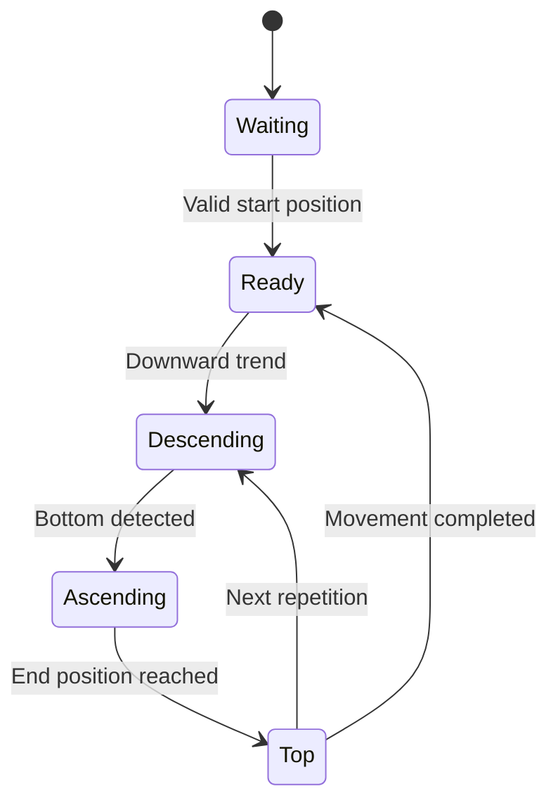

# Exercise Analyzer

**A video-based exercise analysis application that detects repetitions and evaluates movement quality using human pose estimation.**

The Exercise Analyzer processes recorded workout videos, tracks body landmarks, separates the movement into individual repetitions, and evaluates each repetition using exercise-specific quality criteria. The current prototype supports **push-ups** and **squats** and presents the results in an interactive desktop interface.

> This project serves as a modular prototype for camera-based movement analysis.

## Showcase


| Exercise selection and video upload | Repetition-by-repetition results |
| --- | --- |
|  |  |

## What the Application Does

1. The user selects an exercise and uploads a recorded video.
2. MediaPipe Pose detects the person's body landmarks in each frame.
3. Relevant joint angles and body positions are calculated.
4. A state-based algorithm identifies the start, bottom, and end of each repetition.
5. Exercise-specific metrics are extracted for every detected repetition.
6. The measured values are compared with predefined reference ranges.
7. The annotated video and quality results are displayed in the graphical interface.


## Features

- Analysis of recorded **push-up** and **squat** videos
- Detection and tracking of 33 body landmarks with MediaPipe Pose
- Automatic identification of individual repetitions
- Segmentation into start, bottom, and end positions
- Separation of downward and upward movement phases
- Exercise-specific joint-angle and posture analysis
- Rule-based evaluation using configurable reference ranges
- Per-repetition feedback instead of only one overall result
- Annotated video playback with a pose skeleton overlay
- Graphical comparison of measured and optimal values
- Visibility checks and handling of missing pose data
- Modular architecture for adding exercises and evaluation criteria

## Evaluated Metrics

### Push-Ups

- Minimum and maximum elbow angle
- Elbow range of motion
- Body-line orientation
- Hip flexion
- Shoulder position
- Left-right symmetry
- Total repetition duration
- Descent and ascent time
- Movement velocity and time spent near the bottom position

### Squats

- Minimum and maximum knee angle
- Knee range of motion
- Squat depth based on hip and knee position
- Torso lean at the bottom position
- Left-right knee symmetry
- Total repetition duration
- Descent and ascent time
- Movement velocity and time spent near the bottom position

## Repetition Detection

Repetitions are detected with a finite-state approach that follows the movement through its main phases. A rolling trend window confirms changes in direction and reduces false detections caused by small landmark fluctuations.



Detected repetitions are validated using minimum requirements for range of motion and movement duration before they are analyzed further.

## Technologies

| Technology | Purpose |
| --- | --- |
| **Python 3.11** | Core application and analysis logic |
| **MediaPipe Pose** | Human pose estimation and landmark tracking |
| **OpenCV** | Video processing, frame handling, and visualization |
| **NumPy** | Numerical calculations and movement metrics |
| **CustomTkinter** | Modern desktop user interface |
| **Pillow** | Image conversion and GUI integration |

## Architecture

The application separates pose estimation, repetition detection, metric extraction, quality evaluation, and visualization into independent components. This makes it possible to modify reference ranges or add new exercises without redesigning the complete processing pipeline.

```text
Video
 └── Pose estimation
      └── Landmark and angle extraction
           └── Repetition detection
                └── Exercise-specific analysis
                     └── Quality evaluation
                          └── Result visualization
```

## Getting Started

### Requirements

- Python 3.11
- A recorded video showing one person from a suitable side view
- The full body and relevant joints should remain visible throughout the exercise

### Installation

```bash
git clone https://github.com/<your-username>/exercise-analyzer.git
cd exercise-analyzer

python -m venv .venv
```

Activate the virtual environment:

```bash
# Windows
.venv\Scripts\activate

# Linux/macOS
source .venv/bin/activate
```

Install the dependencies:

```bash
pip install -r requirements.txt
```

Start the application:

```bash
python main.py
```

## Usage

1. Start the desktop application.
2. Select **Push-Up** or **Squat**.
3. Upload a compatible video file.
4. Start the analysis.
5. Review the detected repetitions and their individual quality metrics.

For reliable results, record the exercise from the side with a stable camera. Avoid major occlusions and ensure that the relevant joints remain inside the frame.

## Current Limitations

- The prototype currently supports only push-ups and squats.
- Analysis is performed on recorded videos rather than a live camera stream.
- Results depend on camera angle, lighting, landmark visibility, and video quality.
- Exercise evaluation is based on predefined reference ranges and does not replace professional coaching.
- Depth values estimated from a monocular camera are not equivalent to exact 3D measurements.
- The current evaluation was performed on a limited number of recorded test sequences.

## Future Improvements

- Real-time analysis using a webcam or mobile camera
- Support for additional strength and mobility exercises
- Automatic camera-position and visibility guidance
- More robust temporal filtering of pose landmarks
- Improved 3D movement analysis or multi-camera support
- User-specific calibration and configurable training goals
- Audio or visual feedback during exercise execution
- Larger evaluation dataset with different people, environments, and camera perspectives
- Automated tests for detection logic and evaluation rules
- Exportable workout summaries and progress tracking

## Project Background

The project explores how computer vision can make exercise feedback more accessible without requiring wearable sensors. Its main focus is the complete analysis pipeline—from video input and pose estimation to repetition detection, movement assessment, and understandable visual feedback.

The system is intentionally designed as a prototype: its modular structure provides a foundation for future exercises, alternative pose-estimation models, and more advanced evaluation methods.

## Author

**Ben Engelhardt**  

